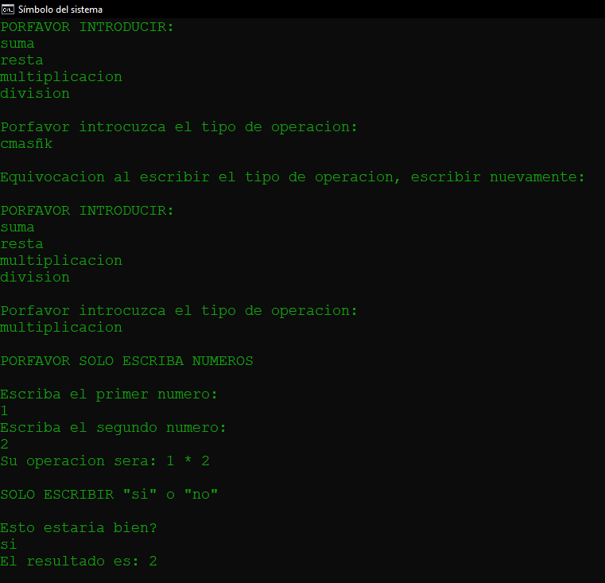

# CalculadoraSimple
Calculadora que da opcion de elegir entre:
 
°Suma
°Resta
°Multiplicación
°División
Si se escribe una palabra o no se escribe un numero donde es debido,
detecta el error y pide que vuelva a escribir lo que desea

# Imagen demostración
Todavía tiene algunos errores y tambien se le puede agregar varias cosas para que deje de ser una simple calculadora, si alguien quiere avanzar con este proyecto me sentiria genial porque alguien pudo crear algo mejor con lo que yo pude crear.

